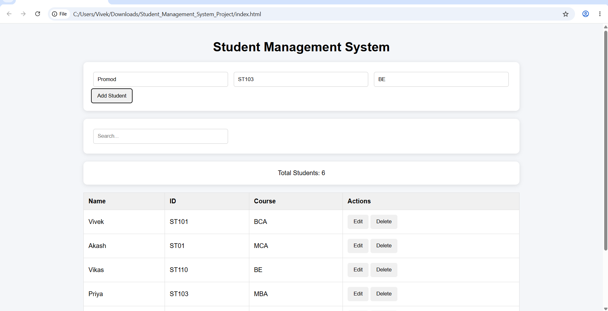
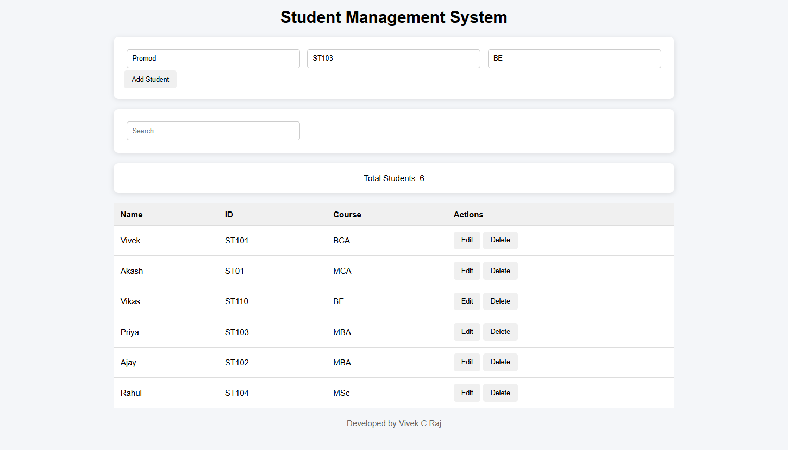
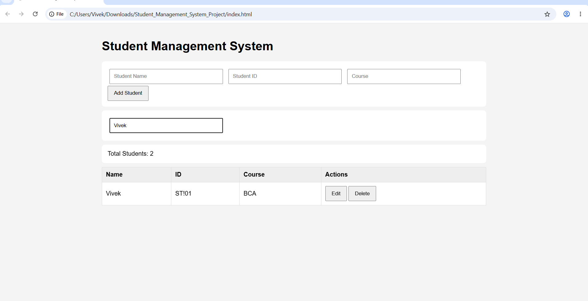
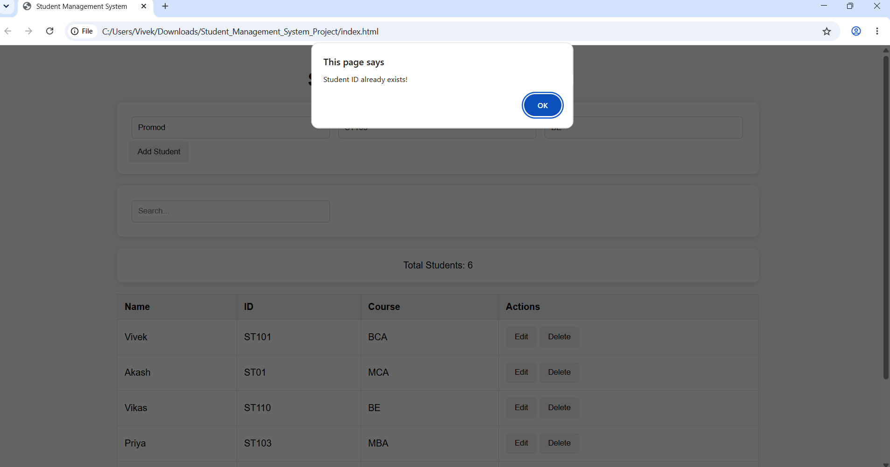
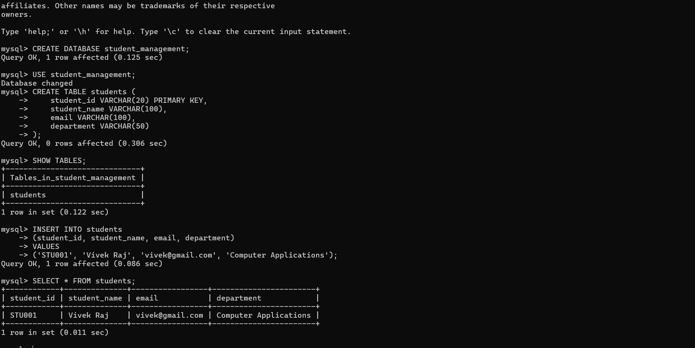

# Student Management System

A responsive web-based **Student Management System** developed using **HTML, CSS, and JavaScript**. The application enables users to manage student records through CRUD operations (Create, Read, Update, Delete) with search functionality, validation, and Local Storage data persistence.

## Features

* Add Student Records
* Edit Student Information
* Delete Student Records
* Search Students by Name, ID, or Course
* Duplicate Student ID Validation
* Client-side Form Validation
* Delete Confirmation Popup
* Responsive User Interface
* Local Storage Data Persistence
* MySQL Database Design & CRUD Queries
* Git & GitHub Version Control

## Technologies Used

* HTML5
* CSS3
* JavaScript (ES6)
* Local Storage
* MySQL
* SQL
* Git
* GitHub

## Screenshots

### Dashboard


### Student Records


### Search Functionality


### Duplicate ID Validation


### Database Creation & Insert Operation


### SQL CRUD Operations


## Database Schema

```sql
CREATE TABLE students (
    student_id VARCHAR(20) PRIMARY KEY,
    student_name VARCHAR(100),
    email VARCHAR(100),
    department VARCHAR(50)
);
```

## SQL Queries Used

### Insert Student

```sql
INSERT INTO students
(student_id, student_name, email, department)
VALUES ('STU001', 'Vivek Raj', 'vivek@gmail.com', 'Computer Applications');
```

### Search Student

```sql
SELECT * FROM students
WHERE student_name LIKE '%Vivek%';
```

### Update Student

```sql
UPDATE students
SET email = 'vivekcraj@gmail.com'
WHERE student_id = 'STU001';
```

### Delete Student

```sql
DELETE FROM students
WHERE student_id = 'STU001';
```

## Project Structure

```text
student-management-system/

├── index.html
├── style.css
├── script.js
├── README.md
└── Screenshots/
```

## How to Run

1. Clone the repository:

```bash
git clone https://github.com/vivek65666/student-management-system.git
```

2. Open the project folder.

3. Open `index.html` in any modern web browser.

4. Start adding, editing, searching, and deleting student records.

## Project Highlights

* Developed a complete CRUD application using JavaScript.
* Implemented Add, Edit, Delete, and Search functionality.
* Added duplicate Student ID validation.
* Utilized Local Storage for persistent client-side data management.
* Demonstrated MySQL database creation and SQL CRUD operations.
* Designed a responsive and user-friendly interface.
* Applied testing and debugging techniques.
* Managed source code using Git and GitHub.

## Author

**Vivek C Raj**

GitHub: https://github.com/vivek65666
